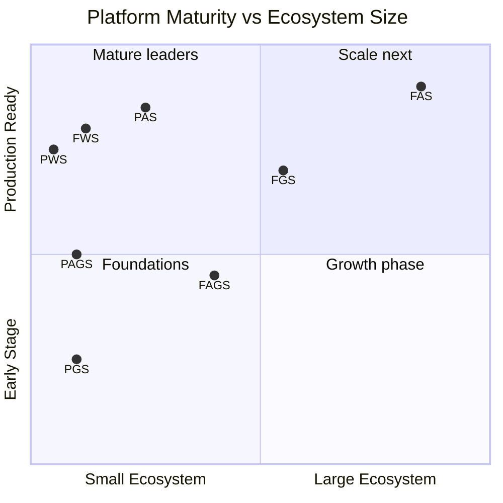

# Growth & Metrics

## Ecosystem size (snapshot as of 2026-06-09)

```mermaid
bar
    title Repositories per Store
    x-axis ["FAS", "FGS", "PAS", "PGS", "FWS", "PWS", "FAGS", "PAGS"]
    y-axis "Repos" 0 --> 150
    bar [144, 80, 28, 14, 14, 1, 52, 11]
```

| Metric | Count |
|--------|:-----:|
| Total GitHub repositories | 344 |
| GitHub organizations | 8 |
| Live apps (FAS) | ~44 |
| Live games (FGS) | ~50 |
| Live websites (FWS) | ~10 |
| Live agents (FAGS) | 53 |
| Pro apps (PAS) | ~13 |
| Total deployed items | ~170+ |

## Platform maturity



## Engineering metrics

| Store | Source files | Tests | Test ratio | CI workflows | Compliance checks |
|-------|:-----------:|:-----:|:----------:|:------------:|:-----------------:|
| FAS | 194 | 81 | 0.42 | 11 | 20 |
| PAS | 293 | 98 | 0.33 | 11 | 42 |
| FGS | 119 | 31 | 0.26 | 4 | 38 |
| FWS | 103 | 192 | 1.87 | 7 | — |
| PWS | 135 | 398 | 2.95 | 2 | — |
| FAGS | 354 | 60 | 0.17 | 6 | 9 |
| PAGS | 79 | 19 | 0.24 | 4 | 6 |
| PGS | 112 | 31 | 0.28 | 4 | — |

**Total:** 1,389 source files, 910 tests, 49 CI workflows

## SDK adoption

| SDK | Version | Published | npm downloads |
|-----|---------|-----------|:------------:|
| @freeappstore/sdk | 0.14.11 | Yes (OIDC) | — |
| @freeappstore/cli | 0.4.23 | Yes (OIDC) | — |
| @proappstore/sdk | 1.16.10 | Yes (OIDC) | — |
| @proappstore/cli | 2.6.6 | Yes (OIDC) | — |
| @freegamestore/games | 0.14.0 | Yes (OIDC) | — |
| @freegamestore/cli | 0.2.2 | Yes (OIDC) | — |
| @progamestore/games | 0.2.1 | Yes (OIDC) | — |
| @progamestore/cli | 0.1.3 | Yes (OIDC) | — |

## Development velocity

- **Solo founder + AI-assisted development** (Claude Code, Codex)
- Platform built in ~3 months (April-June 2026)
- 344 repos created and maintained
- Full CI/CD automation (push to main = deploy)
- AI builder (VibeCode) ships apps/games/sites without manual coding
