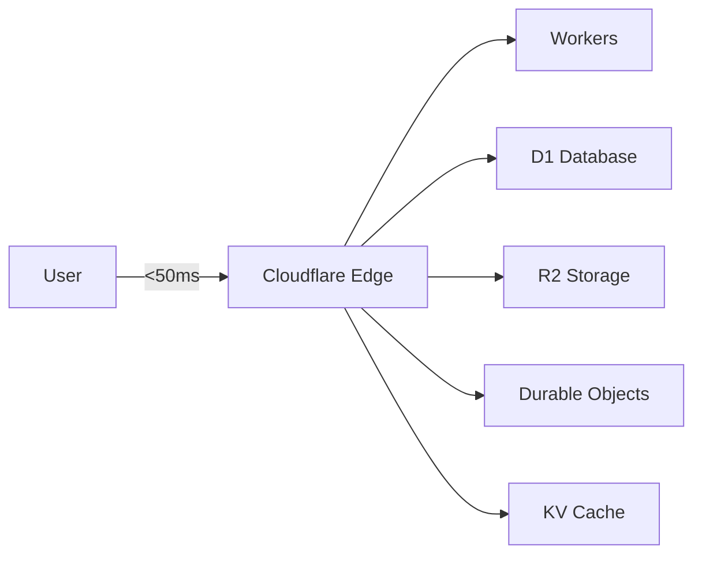
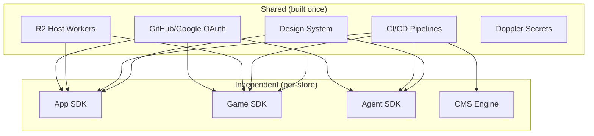

# Technical Moat

## Why this is hard to replicate

### 1. Edge-native architecture

Everything runs at the edge. No origin servers. No cold starts. Sub-50ms responses globally. This isn't bolted-on CDN caching — the application logic itself executes in 300+ data centers.

### 2. Compliance-as-code

Every item in every store passes automated quality gates before publishing:

- **Up to 42 checks** (brand, security, performance, accessibility)
- **Automated viewport testing** (12 device sizes via Playwright)
- **Bundle size budgets** (300KB gzipped max)
- **No-tracking enforcement** (blocks Google Analytics, Mixpanel, etc.)
- **Brand consistency** (fonts, colors, spacing enforced by CI)

Competitors can copy the store concept but not the quality infrastructure built into every deploy pipeline.

### 3. AI-native publishing

Three creation paths, all AI-powered:

| Path | How | Time to publish |
|------|-----|:-:|
| **VibeCode** (AI builder) | Describe what you want in chat | ~2 minutes |
| **CLI** | Scaffold template, code, `fas publish` | ~30 minutes |
| **MCP** (AI editor) | Build in Cursor/Claude, tools deploy for you | ~10 minutes |

The AI doesn't just assist — it's a primary operator. FWS builds complete websites from a conversation. FAGS creates browser AI tools. PAGS creates server agents.

### 4. Zero-cost free tier (permanent)

Free stores cost almost nothing to operate:
- Cloudflare Workers free tier: 100k requests/day
- R2: first 10GB free, $0.015/GB after
- D1: first 5M rows free
- GitHub Actions: free for public repos

This means free stores can stay free **indefinitely** without VC-funded burn rate. They're self-sustaining.

### 5. Shared infrastructure, independent products

Build once (auth, hosting, CI, secrets, design system), deploy across all 8 stores. Each store's SDK is independent but the infrastructure cost is amortized.

### 6. Ecosystem lock-in (positive)

- Creators use the same identity across all stores
- One CLI (`fas`) works for apps; `fgs` for games; same mental model
- Same design system = users feel at home across stores
- Same compliance = quality is uniform
- Cross-store MCP = AI agents can operate across the ecosystem

### 7. AI model portability (FAGS unique moat)

Browser-based AI tools run on the user's hardware. This means:
- **Zero inference cost** to the platform
- **Works offline** (after model download)
- **No API rate limits**
- **Privacy** (data never leaves the device)
- **Scales infinitely** (more users = more GPUs, not more servers)

No server-side AI company can compete on cost with "runs on user's GPU for free."
