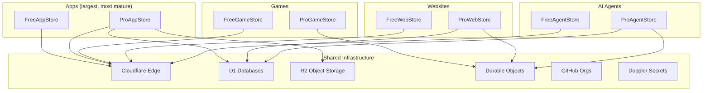

# Product Lines

Six verticals, each with a free and pro tier.

## Product architecture

## Apps: FreeAppStore + ProAppStore

**What:** PWA app store with full SDK (auth, storage, real-time, email, webhooks).

| | Free (FAS) | Pro (PAS) |
|--|-----------|-----------|
| Hosting | R2 + CDN | R2 + CDN + custom domains |
| Storage | 1MB KV/user | 10MB KV + per-app D1 database |
| Real-time | 32 peers/room | Uncapped rooms |
| AI | User's API key via proxy | Server-side Workers AI |
| Email | 100/day | Unlimited |
| Monetization | N/A | $9/mo subscription pool |
| Source | MIT required | Proprietary allowed |

**Status:** Production. 44 apps (free) + 13 apps (pro). SDK v0.14/v1.16. Stripe live.

---

## Games: FreeGameStore + ProGameStore

**What:** Browser game store with brand-consistent shell, leaderboards, and automated quality testing.

| | Free (FGS) | Pro (PGS) |
|--|-----------|-----------|
| Hosting | R2 wildcard | CF Pages (migrating to R2) |
| Multiplayer | Chat rooms (32 peers) | Server-authoritative state (DOs) |
| AI | N/A | AI NPCs (Workers AI) |
| Persistence | localStorage only | Cloud save (D1) |
| Templates | 8 (2D/3D/cards/grid) | 3 (realtime/turn-based/persistent) |

**Status:** 50+ games live (free). Pro is early scaffold — CLI works but templates aren't on GitHub yet.

---

## Websites: FreeWebStore + ProWebStore

**What:** AI-built websites. Free = one-page static. Pro = full CMS with knowledge graph.

| | Free (FWS) | Pro (PWS) |
|--|-----------|-----------|
| Output | Single-page HTML | Multi-page CMS |
| Builder | AI chat (108 niche templates) | AI-operated knowledge graph |
| Hosting | KV edge (sub-second deploy) | Worker + D1 + R2 |
| Customization | Colors, content, sections | Custom blocks, entities, plugins |
| Target | Small business one-pagers | Serious business sites |

**Status:** FWS is production (AI builds and deploys in <1 second). PWS mid-architecture-pivot toward per-site repos.

---

## AI Agents: FreeAgentStore + ProAgentStore

**What:** AI tools store. Free = browser-only (user's GPU). Pro = server-powered (Workers AI).

| | Free (FAGS) | Pro (PAGS) |
|--|-----------|-----------|
| Runtime | Browser (WebGPU/WASM) | Cloudflare Workers |
| AI cost | Zero (user's hardware) | Workers AI included |
| State | None or localStorage | D1 + Durable Objects |
| Types | Libraries, Models, Agents | Agent templates + instances |
| Catalog | 53 agents | 10 flagship agents |

**Status:** Both early beta. FAGS has volume (53 agents). PAGS has depth (full marketplace with subscriptions, isolated DOs).

---

## Design: FreeDesignStore + ProDesignStore

**What:** Browser-based design tools. Free = 43 self-contained HTML tools (no signup, no watermarks). Pro = AI design agent + designer marketplace.

| | Free (FDS) | Pro (PDS) |
|--|-----------|-----------|
| Tools | 43 browser tools | AI design agent |
| Categories | Brand (16), Images (12), Templates (6), UI/UX (9) | AI generation + marketplace |
| AI | Chrome AI via ai-queue.js | Workers AI (server-side) |
| Output | SVG, PNG, CSS, HTML | Full brand packages |
| Marketplace | N/A | Hire designers ($15-500) |
| Signup | None | Required |

**Key tools:** Logo Maker (1115 lines, brand pack export), Color Palette (HSL wheel, image extraction), Tailwind Theme Builder, CSS Animation Studio, Image Resizer (950 lines, platform presets), Format Converter (933 lines), UI Component Library, Form Builder, Landing Page Builder, Moodboard.

**URLs:** [freedesignstore.pages.dev](https://freedesignstore.pages.dev) | prodesignstore.pages.dev (scaffolded)

**Status:** FDS is live with 43 tools across 4 categories. PDS has console + backend + agent-teams scaffolded (D1 schema, wrangler.toml, marketplace page).

---

## Marketing: FreeMarketingStore + ProMarketingStore

**What:** Marketing tools and campaign automation. Free = 21 browser tools. Pro = autonomous AI campaign agent + marketer marketplace.

| | Free (FMS) | Pro (PMS) |
|--|-----------|-----------|
| Tools | 21 browser tools | AI campaign agent |
| Categories | Campaigns (7), Content (6), SEO (4), Social (4) | Autonomous execution |
| AI | User's OpenAI key (opt-in) | Workers AI + cron |
| Integrations | None (planning only) | X, LinkedIn, IG, Mailgun |
| Marketplace | N/A | Hire marketers ($29-999) |
| Signup | None | Required |

**Key tools:** Domain Finder (1010 lines, Chrome AI, 34 TLDs), AI Content Writer (1563 lines, user's own OpenAI key), Content Calendar (850 lines, drag-and-drop), Social Post Generator (762 lines, 30+ templates), Campaign Planner, Headline Tester, SWOT Analysis.

**URLs:** freemarketingstore.pages.dev | promarketingstore.pages.dev (scaffolded)

**Status:** FMS is live with 21 tools. PMS has console + campaigns page + backend + agent-teams scaffolded.

---

## Simulations: 6 Knowledge Stores

**What:** Interactive simulations for learning hard subjects. Single HTML files, no backend, no signup.

| Store | Domain | Items | Focus |
|-------|--------|-------|-------|
| FRS (Robots) | freerobotstore.pages.dev | 44 | Robotics, kinematics, neuroevolution |
| FQS (Quantum) | freequantumstore.pages.dev | 27 | Quantum circuits, teleportation, algorithms |
| FCRS (Crypto) | freecryptostore.pages.dev | 25 | Blockchain, DeFi, smart contracts, cryptography |
| FCS (Chips) | freechipstore.pages.dev | 26 | CPU design, ALUs, pipelines, logic gates |
| FSS (Space) | freespacestore.pages.dev | 24 | Orbital mechanics, constellations, propulsion |
| FBS (Bio) | freebiostore.pages.dev | 20 | Protein folding, CRISPR, neural networks, ecology |

**Total:** 166 interactive simulations.

**Status:** All live on CF Pages with auto-deploy, sitemaps, OG tags, JSON-LD, CONTRIBUTING.md, community infrastructure.
