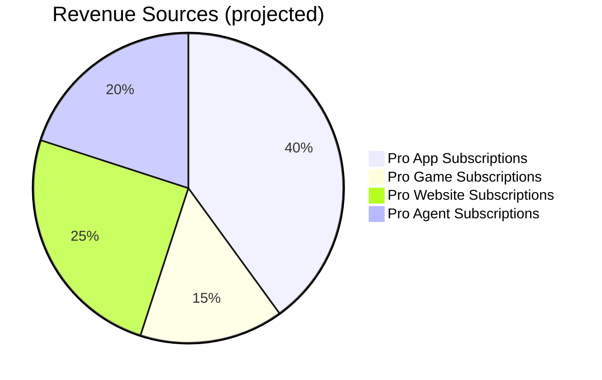
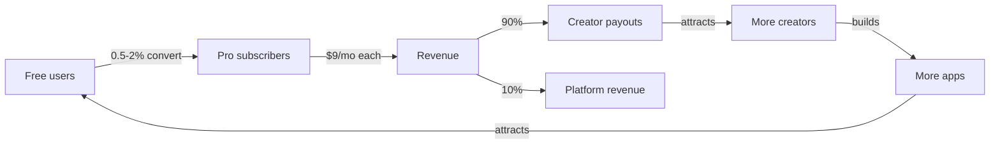

# Revenue Model

## Structure

## How it works

### Free tier (FAS, FGS, FWS, FAGS)
- **Cost to user:** $0 forever
- **Revenue:** $0 (these are acquisition channels, not profit centers)
- **Cost to operate:** ~$50/mo total (Cloudflare Workers free tier covers most; R2 costs negligible at current scale)

### Pro tier (PAS, PGS, PWS, PAGS)

**Single platform subscription: $9/month**

One subscription unlocks EVERY Pro app, game, site, and agent. No per-item pricing.

**Creator payouts (Spotify model):**
1. User subscribes for $9/mo
2. Platform takes 10% fee ($0.90)
3. Remaining $8.10 distributed to creators proportional to that user's usage
4. Usage = time spent + API calls per app per month
5. Stripe Connect for creator payouts

### Example unit economics

| Metric | Value |
|--------|-------|
| Subscription price | $9/mo |
| Platform fee | 10% ($0.90) |
| Creator pool | $8.10/subscriber/mo |
| Infrastructure cost/subscriber | ~$0.50/mo (Workers AI, D1, R2) |
| Gross margin on platform fee | ~44% after infra |

### PWS (exception)

ProWebStore uses **per-site pricing** (not the platform subscription) because each site is an independent deployment with its own infrastructure costs.

## Growth path

## Current state

- **Pre-revenue** — marketplace mechanics built (Stripe live on PAS) but not yet charging
- **Focus:** Build ecosystem density first, then turn on monetization
- **Target:** 1000+ free items across stores before launching Pro subscriptions publicly
