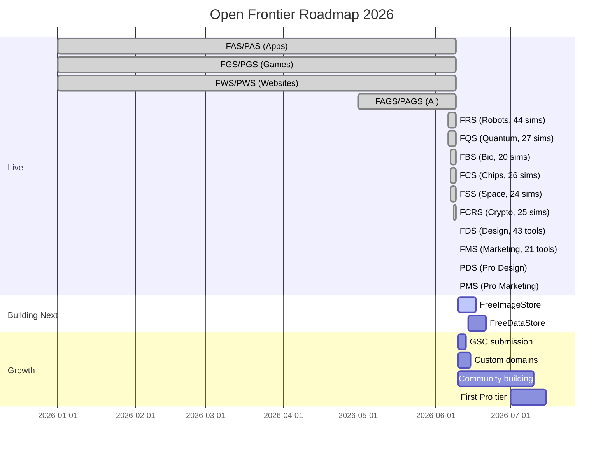

# Roadmap & Plan

## What's Been Built

### FreeDesignStore (FDS) — SHIPPED

43 tools across 4 categories, live at [freedesignstore.pages.dev](https://freedesignstore.pages.dev).

| Category | Count | Highlights |
|----------|-------|------------|
| Brand | 16 | Logo Maker (1115 lines, 42+ SVG icons), Color Palette, Tailwind Theme, CSS Animation, Design Tokens |
| Images | 12 | Image Resizer (950 lines), Format Converter (933 lines), Gradient Maker, Vector Editor |
| Templates | 6 | Social Templates, OG Image Maker, Presentation Maker, Mockup Generator |
| UI/UX | 9 | UI Component Library, Form Builder, Landing Page Builder, Dashboard Builder |

Chrome AI integration via `ai-queue.js` for on-device inference (AI Color from Text, AI Logo Concepts).

### FreeMarketingStore (FMS) — SHIPPED

21 tools across 4 categories, live at freemarketingstore.pages.dev.

| Category | Count | Highlights |
|----------|-------|------------|
| Campaigns | 7 | Campaign Planner, Content Calendar (850 lines), A/B Calculator, UTM Builder |
| Content | 6 | AI Content Writer (1563 lines, user's OpenAI key), Headline Tester, Persona Builder |
| SEO | 4 | Domain Finder (1010 lines, Chrome AI, 34 TLDs), Keyword Planner, Meta Generator |
| Social | 4 | Post Generator (762 lines, 30+ templates), Social Scheduler, Hashtag Research |

### ProDesignStore (PDS) — SCAFFOLDED

Console + agent + marketplace pages live. Backend with D1 schema and agent-teams package scaffolded. Not yet deployed as a Worker.

### ProMarketingStore (PMS) — SCAFFOLDED

Console + campaigns + marketplace pages live. Backend with D1 schema and agent-teams package (5-agent pipeline) scaffolded. Not yet deployed as a Worker.

### FreeCryptoStore (FCRS) — SHIPPED

25 simulations covering blockchain, DeFi, smart contracts, cryptography. Live at [freecryptostore.pages.dev](https://freecryptostore.pages.dev).

### Simulation Stores — ALL UPDATED

| Store | Previous | Current |
|-------|----------|---------|
| FRS | 40 sims | 44 sims |
| FQS | 25 sims | 27 sims |
| FCRS | 21 sims | 25 sims |
| FCS | 22 sims | 26 sims |
| FSS | 22 sims | 24 sims |
| FBS | 18 sims | 20 sims |
| **Total** | **148** | **166** |

## Next Stores to Build

### Priority 1: FreeImageStore (FIS)

**Why next:** Unsplash model proven. "Free stock photos" = massive search traffic. Complements FDS (design tools need images).

| Feature | Description |
|---------|-------------|
| Browse & Search | Categories, tags, color search, similar images |
| AI Generation | Describe what you need, get images instantly |
| Community Upload | Contribute photos under CC license |
| Collections | Curated sets by topic, mood, color |
| Download | Multiple resolutions, no watermark, no signup |

**Competitors:** Unsplash, Pexels, Pixabay (all require signup for HD).
**Our edge:** No signup at all. AI-generated = infinite niche supply.

### Priority 2: FreeDataStore

Data visualization and analysis tools. Charts, dashboards, dataset exploration.

## Timeline

## Decision Log

| Date | Decision | Reasoning |
|------|----------|-----------|
| 2026-06-09 | FDS shipped with 43 tools (not 25) | Expanded scope: added UI/UX category + more image tools |
| 2026-06-09 | FMS shipped with 21 tools | 4 categories: campaigns, content, SEO, social |
| 2026-06-09 | PDS + PMS scaffolded same day | Console + backend + agent-teams, same PAS architecture |
| 2026-06-09 | FreeAdStore (FADS) planned | Ad creation, preview, budget, compliance tools |
| 2026-06-08 | FreeCryptoStore, not FreeLedgerStore | "Crypto" is what people search |
| 2026-06-08 | No SDKs for simulation stores | Sims are self-contained HTML, no runtime services |
| 2026-06-08 | One Discord per store | Different audiences per domain |
| 2026-06-08 | Design + Marketing = two stores | Different users, different search intent |
| 2026-06-08 | FreeImageStore added | Unsplash model fits, high SEO value |
| 2026-06-08 | ProCrypto deferred | Regulatory risk of mainnet token deployment |

## Current Store Health

| Store | Items | SEO | Deploy | Discord | Community |
|-------|-------|-----|--------|---------|-----------|
| FRS | 44 | Full | Auto | Active | CONTRIBUTING.md |
| FQS | 27 | Full | Auto | Active | CONTRIBUTING.md |
| FCRS | 25 | Full | Auto | Pending | CONTRIBUTING.md |
| FCS | 26 | Full | Auto | Pending | CONTRIBUTING.md |
| FSS | 24 | Full | Auto | Pending | CONTRIBUTING.md |
| FBS | 20 | Full | Auto | Pending | CONTRIBUTING.md |
| FDS | 43 | Pending | Auto | Pending | CONTRIBUTING.md |
| FMS | 21 | Pending | Auto | Pending | - |
| PDS | Scaffolded | - | Manual | - | - |
| PMS | Scaffolded | - | Manual | - | - |
| FAS | 144 | Partial | Auto | Active | SDK + CLI |
| FGS | 80 | Partial | Auto | Active | SDK + templates |
