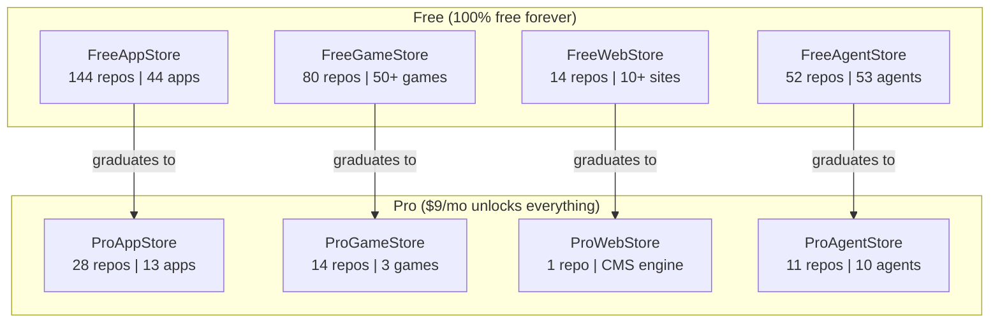

# Open Frontier One Platform Ecosystem

Open Frontier One (OFO) is the umbrella over the store ecosystem: curated stores for web apps, games, websites, AI agents, browser tools, and interactive knowledge.

The OFO public website lives in `landing/` and is deployed as `openfrontier.one`. The docs you are reading live in `docs/` and are deployed as `docs.openfrontier.one`.

## At a glance

- **344 repositories** across 8 GitHub organizations
- **170+ live items** deployed and accessible worldwide
- **4 product verticals** (apps, games, websites, AI agents)
- **1 umbrella site** (`landing/`) presenting the whole ecosystem
- **Edge-native** on Cloudflare (sub-50ms globally, zero cold starts)
- **AI-first creation** — describe what you want, AI builds and ships it

## The ecosystem

## Explore

- :material-rocket-launch: **[Vision & Strategy](ecosystem/vision.md)**

    Why we're building this. The opportunity. Core principles.

- :material-domain: **[Product Lines](ecosystem/products.md)**

    What each store does. Free vs Pro breakdown.

- :material-layers-triple: **[OFO Umbrella](overview/ofo-umbrella.md)**

    Where the umbrella website and docs live.

- :material-currency-usd: **[Revenue Model](ecosystem/revenue.md)**

    $9/mo subscription. Spotify-style creator payouts.

- :material-chart-line: **[Growth & Metrics](ecosystem/metrics.md)**

    344 repos, 1389 source files, 910 tests. Engineering at scale.

- :material-map-marker-path: **[Roadmap](ecosystem/roadmap.md)**

    Where we are and where we're going.

- :material-shield-lock: **[Technical Moat](ecosystem/moat.md)**

    Why this is hard to replicate.

## Status

| Store | Stage | Live items |
|-------|-------|:----------:|
| FreeAppStore | Production | 44 apps |
| ProAppStore | Production | 13 apps |
| FreeGameStore | Post-beta | 50+ games |
| ProGameStore | Early | 3 games |
| FreeWebStore | Production | 10+ sites |
| ProWebStore | Pivoting | CMS built |
| FreeAgentStore | Beta | 53 agents |
| ProAgentStore | Beta | 10 agents |

---

*Last updated: 2026-06-09 — published from OpenFrontierOne/openfrontier-docs.*
