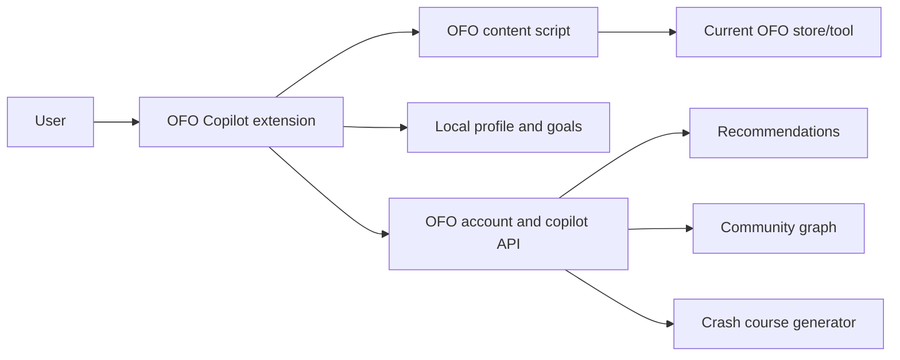

# OFO Copilot Browser Extension

OFO Copilot is the planned browser extension for Open Frontier One. It is a signed-in assistant that helps people learn, build, publish, and connect across OFO-owned platforms and store communities.

The extension is not a general browser monitor. Its privileged context is limited to OFO sites and stores that we operate. Outside those domains, the extension should be inactive unless the user explicitly shares a page or piece of content.

## Product thesis

OFO has many stores, tools, simulations, agents, templates, and communities. A new user should not need to understand the whole map before doing useful work.

The extension becomes the connective layer:

- It understands where the user is inside the OFO ecosystem.
- It knows the user's stated goals, level, and project history.
- It recommends the next useful tool, lesson, store, or community.
- It helps the user move from learning to doing to publishing.

The short version: **OFO Copilot helps users learn, do, and connect across the platform.**

## Core use-cases

### Personal crash courses

A user can ask for a focused course on a topic they do not understand yet:

> I want to learn quantum mechanics. I have no background.

The extension should produce a tailored path:

- calibration questions
- beginner explanation
- glossary
- short exercises
- recommended simulations or tools
- progress checkpoints
- community suggestions for peers or mentors

The course should be attached to the user account, so it can continue across sessions and across stores.

### Contextual platform coaching

When the user is on an OFO store or tool, the extension can explain the current context:

- what this store is for
- what the current tool does
- what inputs mean
- what to try next
- why a result looks wrong
- where to go if this tool is not the right fit

This should be just-in-time help, not a separate documentation hunt.

### Goal navigation

The user can state an outcome:

- Learn enough quantum mechanics to use the simulations.
- Build a simple AI app.
- Publish a small business website.
- Create a marketing plan.
- Find contributors for a project.

The extension breaks the goal into steps and routes the user through the right OFO stores and communities.

### Personal memory and level model

With user consent, the extension can learn:

- skill level by topic
- preferred explanation style
- active goals
- unfinished projects
- tools used recently
- concepts the user struggled with

This memory should be inspectable and deletable by the user.

### Community matching

OFO stores should have communities around subjects, professions, and paired workflows. The extension can connect users with:

- people learning the same thing
- people one level ahead
- mentors
- contributors
- reviewers
- professionals
- project collaborators

Matching must be consent-based. The extension can recommend communities by default, but exposing a user's profile, activity, availability, or project should require explicit opt-in.

### Ask the community

The extension can help turn a messy question into a useful community post:

- summarize the user's goal
- include relevant non-private context
- identify the right community
- suggest tags
- remove secrets or private account data

The user should approve before anything is posted.

### Quality and publishing review

Before publishing something through an OFO tool, the extension can review:

- missing metadata
- broken links
- accessibility basics
- confusing copy
- incomplete setup
- store-specific quality checks

This turns platform standards into live guidance.

## Permission boundary

Default extension access should be limited to OFO-owned domains and store domains:

- `openfrontier.one`
- `*.openfrontier.one`
- `free*.online` store domains owned by OFO
- `pro*.online` store domains owned by OFO
- named Pages preview domains for stores while they are still in transition

The backend should also validate origin and reject telemetry from non-owned domains.

The product should expose a clear state:

- Active on OFO
- Inactive on this site
- User-shared context only

## Data principles

- Do not collect whole-browser activity.
- Do not infer private interests from non-OFO browsing.
- Do not expose a user to community matching without opt-in.
- Let users inspect and delete memory.
- Keep page context compact and purpose-bound.
- Prefer local processing when possible.
- Send server-side events only when needed for account sync, recommendations, or AI assistance.

## MVP scope

The first build should stay small:

- Manifest V3 browser extension.
- Side panel UI.
- Same OFO account sign-in placeholder.
- Content script only on OFO-owned domains.
- Current page context detection.
- "Explain this page" prompt.
- "Create crash course" prompt.
- Local goals and profile storage.
- Local skill level and interests.
- Explicit opt-in before community matching treats the profile as visible.
- Community recommendation placeholder.
- No automatic posting, messaging, or broad automation.

## Architecture sketch

The first implementation can run mostly in the extension with local storage and page extraction. Server-backed account sync, community graph, and AI course generation can be added behind stable API boundaries.

## Open questions

- Which account provider becomes the canonical OFO identity?
- Which store domains are guaranteed OFO-owned and should be in host permissions?
- Where should community profiles live: per store, central OFO, or both?
- What information is safe to use for matching by default?
- Which AI provider or local model path should power crash-course generation?
- Should the extension be published first for Chrome/Edge only, or Firefox as well?

## Build phases

### Phase 1: Local prototype

- Extension side panel.
- OFO-only content script.
- Page context extraction.
- Local profile/goals.
- Static prompt templates for explain, crash course, and next action.

### Phase 2: Signed-in account

- OFO identity session.
- Account-linked goals and progress.
- User-visible memory controls.
- Store-aware recommendations.

### Phase 3: Community graph

- Opt-in user profiles.
- Community recommendations.
- Ask-the-community drafts.
- Peer, mentor, contributor, and professional matching.

### Phase 4: Workflow copilot

- Multi-store project plans.
- Publishing checks.
- Cross-store handoff.
- Human-in-the-loop community and contributor actions.
